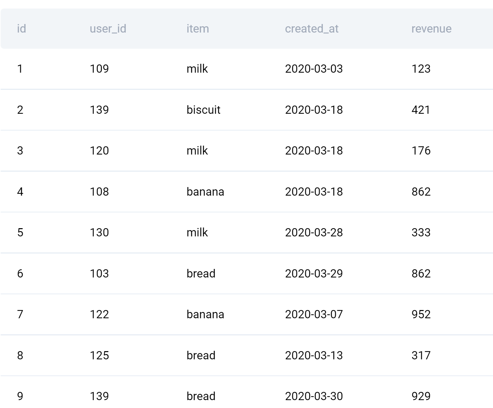
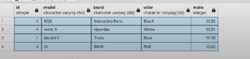

# sql_notes
## References

### SQL queries
####Find duplicate records

```sql
with a as (
	select *, row_number() over (partition by user_name order by user_id) as rn
	from users order by user_id
)
select * from a where rn <> 1
```
#### Write a query that'll identify returning active users. A returning active user is a user that has made a second purchase within 7 days of any other of their purchases. Output a list of user_ids of these returning active users.

```sql
select distinct a1.user_id from amazon_transactions a1 
join amazon_transactions a2 on a1.user_id = a2.user_id
where a1.id <> a2.id and date(a1.created_at) - date(a2.created_at) between 0 and 7
```

#### Delete duplicate records.
##### Solution 1. Delete using unique identifier

```sql
delete from cars where Id in (
select max(Id) from from cars group by model, brand having max(Id) > 1
)
```

### SQL queries - ends
