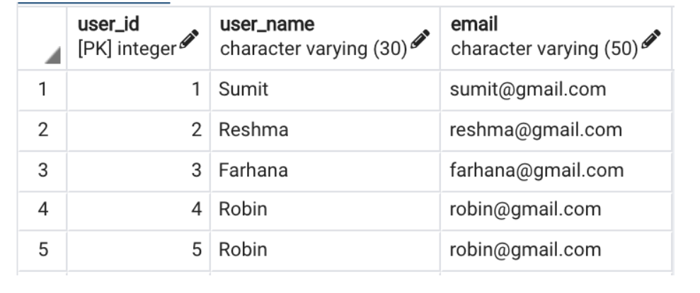

# sql_notes
## References

### SQL queries
####Find duplicate records

```sql
with a as (
	select *, row_number() over (partition by user_name order by user_id) as rn
	from users order by user_id
)
select * from a where rn <> 1
```
### SQL queries - ends
